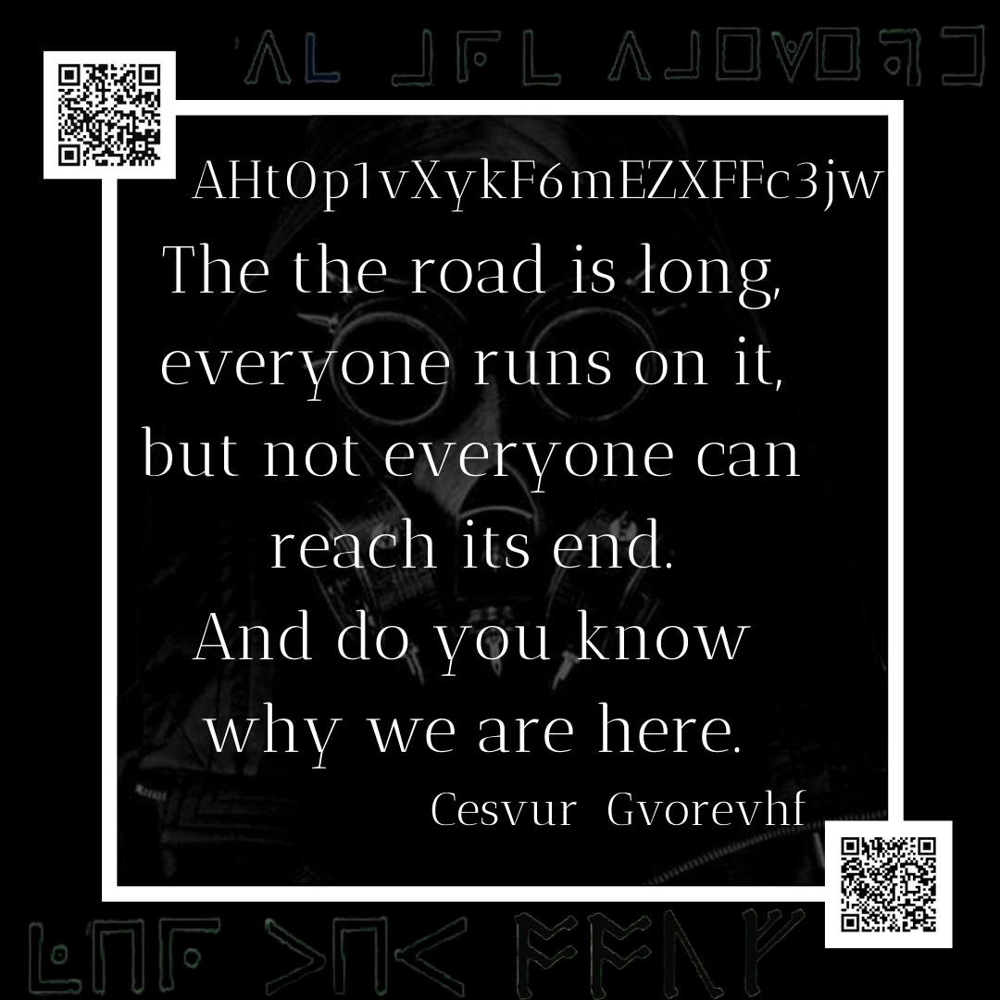

# Original Image



## Author

The author for all of these images is `Corvus Tiberius III` who was a Byzantine emperor during the Twenty Years' Anarchy.

[Wiki here](https://en.wikipedia.org/wiki/Tiberius_III)

### XMP Data

Cesvur Gvorevhf is actually `Corvus Tiberius` - you can find this in the XMP data.

```
 <rdf:Description rdf:about=''
  xmlns:pdf='http://ns.adobe.com/pdf/1.3/'>
  <pdf:Author>Corvus Tiberius III</pdf:Author>
 </rdf:Description>
```

### Signature on First Image

Where Cesvur is a Vignere cipher with key AQBAAZ and Gvorevhf is ROT13.

## Pigpen/Runes

The top and bottom sections in *original* pigpen is `VC ARC VAEWEPD LHR THU`. This is a monoalphabetic substitution cipher.

```
V=W
C=E
A=A
R=R
E=I
W=T
P=N
D=G
L=F
H=O
T=Y
U=U

VC ARC VAEWEPD LHR THU
WE ARE WAITING FOR YOU
```

Runes are Anglo Saxon. All together these spell `OOUF`.

[quipqiup](https://quipqiup.com) monoalphabetic run:

```
0    -0.574    LLER
1    -0.713    XXIV
2    -0.798    PPEN
```

*Note:* Although, not confirmed - I believe this is `XXIV` for the 24 to use on the [little tip image](../05-Little-Tip-analysis/README.md) which gave us [it's before your eyes.png](../06-it's_before_your_eyes.png-analysis/README.md)). If not `PPEN` as a hint for the surrounding symbols.

## QR Codes

### First QR Code

>You don't seem to have many choices, do you?

>OUVFQURpXl4zOkVdPUpeYSVhJCgncg==

>/B64

>/R47

This means base 64 decode above string and apply a ROT+47 which results in [https://bit.ly/2T2SWVC](https://bit.ly/2T2SWVC)

This gives us [magnifying glass.png](../03-magnifying_glass.png-analysis/README.md)

### Second QR Code

>Patience is a virtue

>4421

>https://bit.ly/34Ncovtw94

This gives us [this is not the way.png](../02-this_is_not_the_way.png-analysis/README.md)
