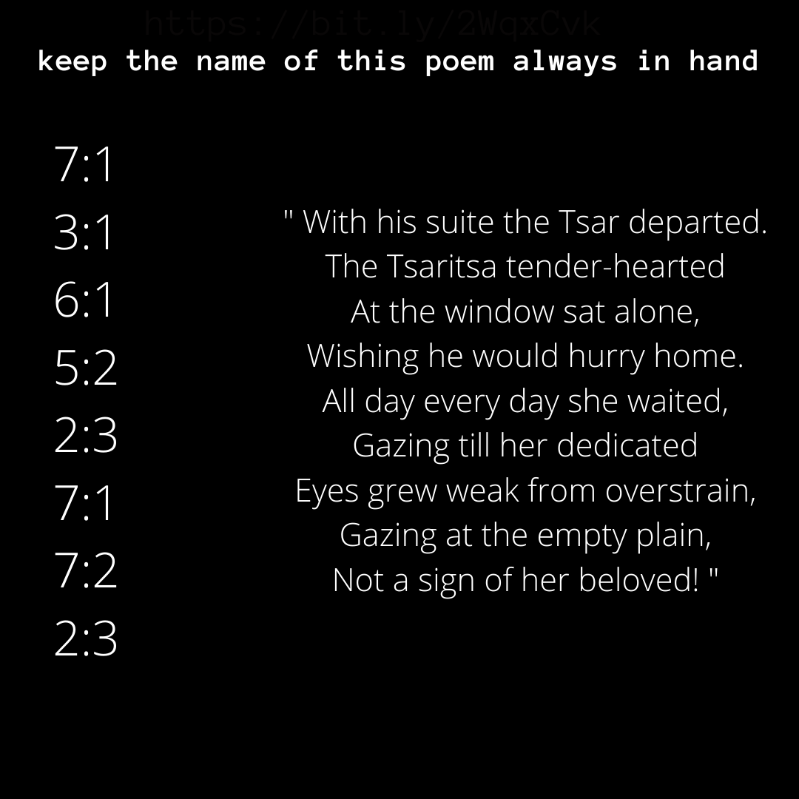
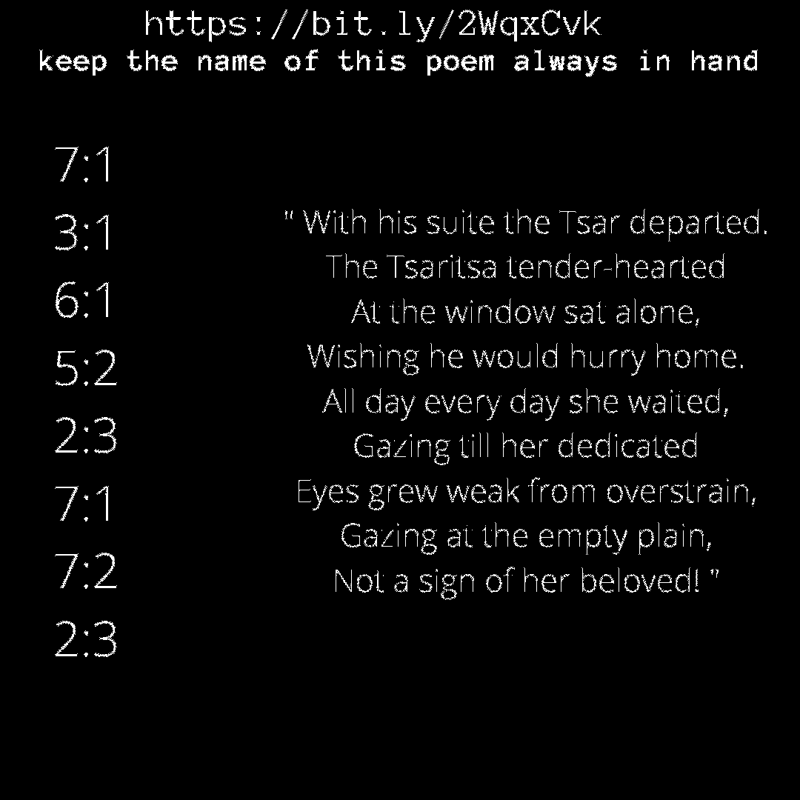

# `magnifying glass.png` (https://bit.ly/2T2SWVC)



## Steganography



## Poem/Book Code

The name of the poem is "The Tale of the Dead princess and the Seven Knights" by Alexander Pushkin.

[Wiki Here](https://en.wikipedia.org/wiki/The_Tale_of_the_Dead_Princess_and_the_Seven_Knights)

The book code is for the poem to the right which results in `eagleeye`.

```
7:1 e
3:1 a
6:1 g
5:2 l
2:3 e
7:1 e
7:2 y
2:3 e
```

`eagleeye` could be a reference to

* The logo from [pain.net known as 'werplogo'](http://pain.net) seen later in Phase 2's [E pluribus unum.png](../../phase2/E_pluribus_unum.png-analysis/README.md) puzzle found on pixel.io.
* [this program](https://github.com/ThoughtfulDev/EagleEye)
