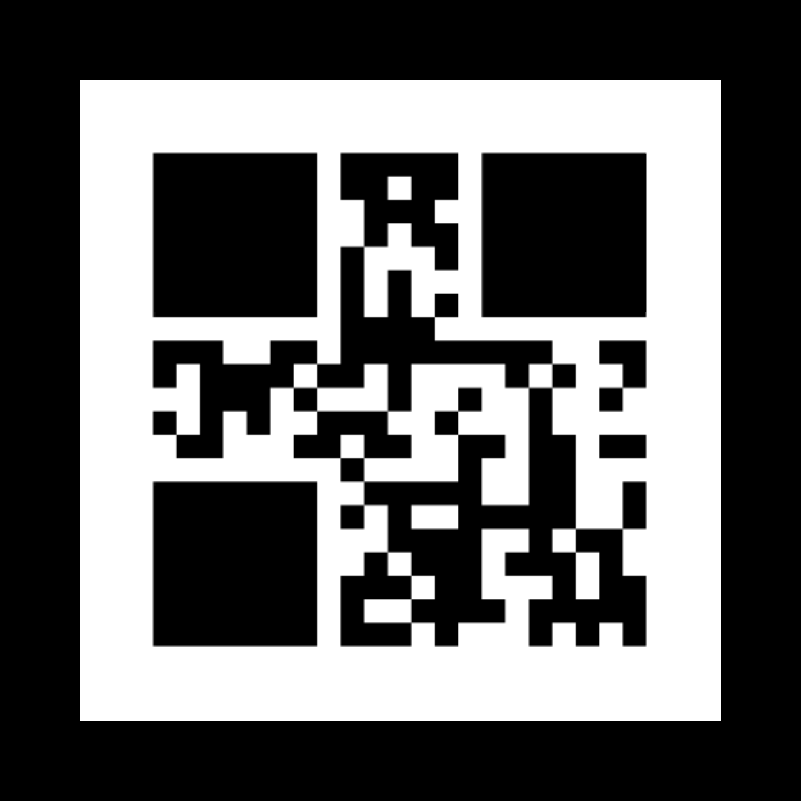
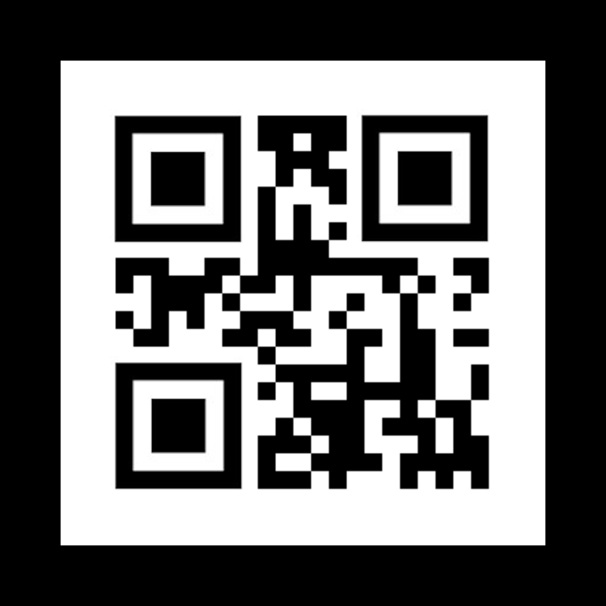

# `Lack.png` (https://bit.ly/2WqxCvk)

## QR Code Reconstruction

This is not a valid QR code. Position/alignment markers are blacked out. After reconstruction you get the message `remove now`. `u/sonsoftiberius` commented that this has dual meaning. (Removing posts and part of bit.ly link)

Output from zbarimg

`QR-Code:remove now`
