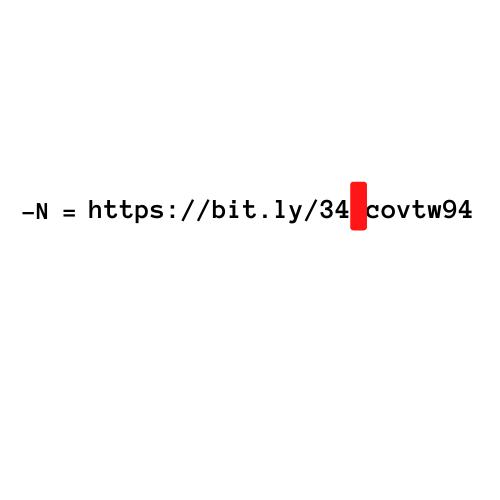

# Little Tip or `c5oxhogbjq151.png` (https://bit.ly/2MdaFWO)

This was in a comment by `u/sonsoftiberius` with "Good Luck". Redirects to a Reddit post.

The URL is the same as the `this is not the way.png` bit.ly link.

Using the `remove now` hint (N already removed).

The puzzle's runes spelled `XXIV` and there was two `The`'s in the original image which hints at 24 or 2, which changes the URL to https://bit.ly/24cvt94
