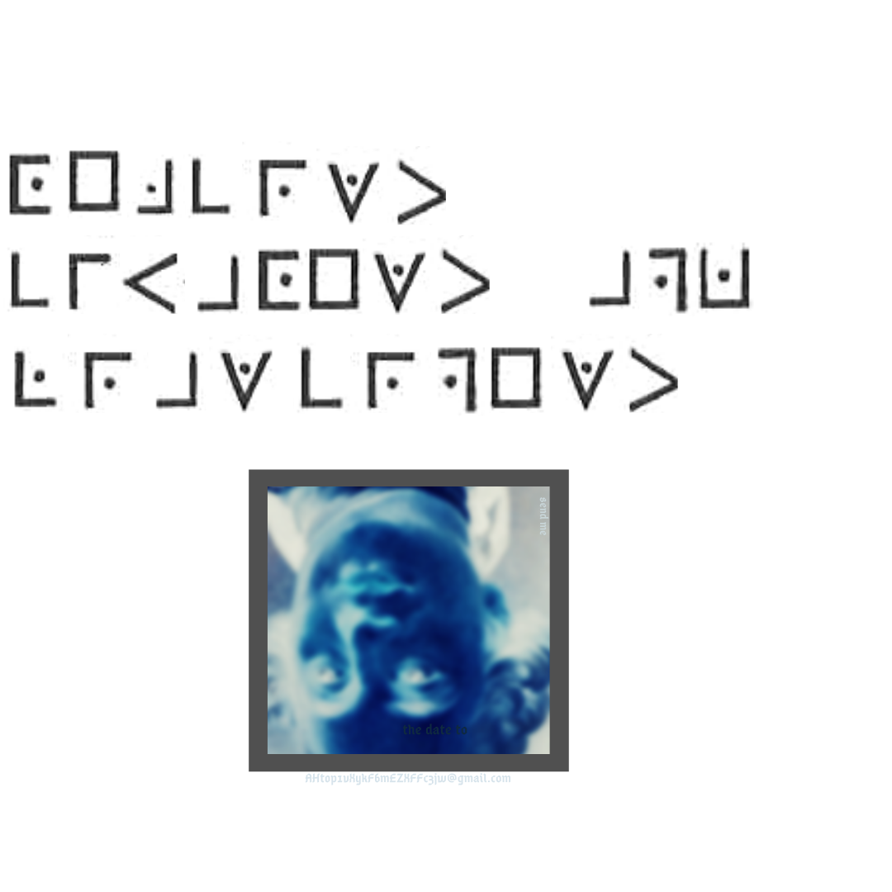
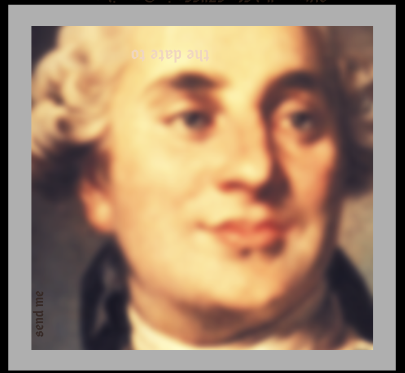
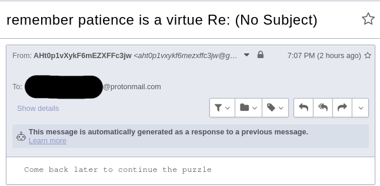

# `it's before your eyes.png` (https://bit.ly/24cvt94)



## Pigpen

The pigpen decodes to `OEJCRWT CIUAOEWT APK LRAWCRPEWT` which can be monalphabetic substituted to `LIBERTY EQUALITY AND FRATERNITY`, which is [France's Motto](https://en.wikipedia.org/wiki/Libert%C3%A9,_%C3%A9galit%C3%A9,_fraternit%C3%A9).

## Louis XIV of France



Reverse image searching this reveals this is `Louis XIV` of France.

[Wiki Here](https://en.wikipedia.org/wiki/Louis_XIV_of_France)

### Steganography

There was a gmail address hidden in the image that matched the profile image of `u/sonsoftiberius`.

AHT0P1VXYKF6MEZXFFC3JW@gmail.com

The image has `send me the date to` in the picture of Louis XVI. Using the `liberty equality and fraternity` hint we arrived at the national motto of France.

[Wiki here](https://en.wikipedia.org/wiki/Libert%C3%A9,_%C3%A9galit%C3%A9,_fraternit%C3%A9)

```
 The first one, according to Mona Ozouf, was one of "fraternité de rébellion" (Fraternity of Rebellion), that is the union of the deputies in the Jeu de Paume Oath of June 1789, refusing the dissolution ordered by the King Louis XVI: "We swear never to separate ourselves from the National Assembly, and to reassemble wherever circumstances require, until the constitution of the realm is drawn up and fixed upon solid foundations." Fraternity was thus issued from Liberty and oriented by a common cause.
```

We emailed the date of the `Tennis Court Oath` to the GMail address, `20 June 1789`.

https://en.wikipedia.org/wiki/Tennis_Court_Oath

## Email Autoreply


