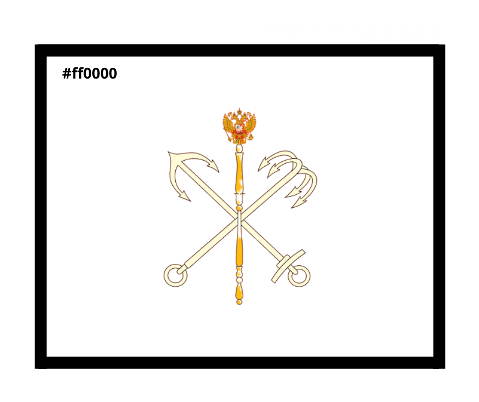
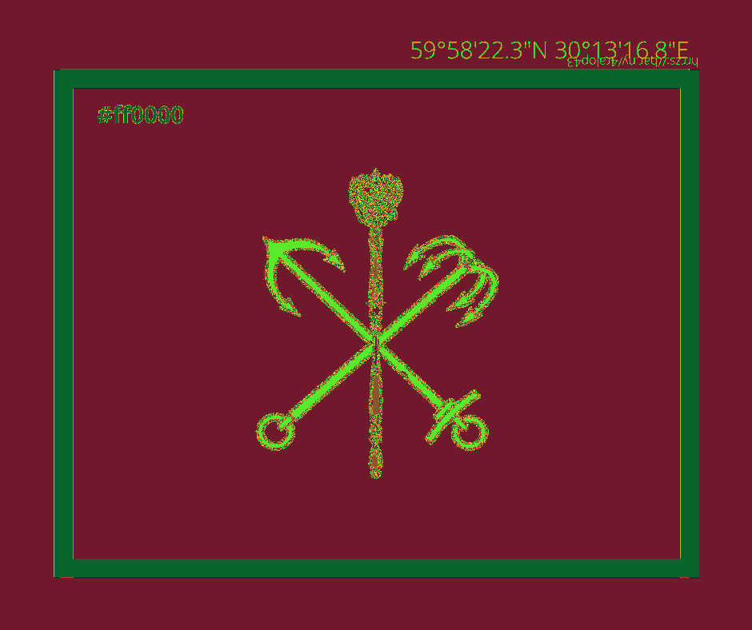
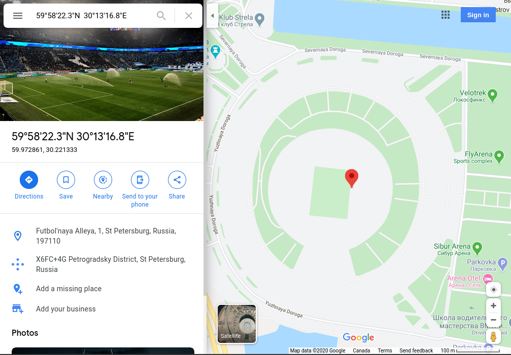
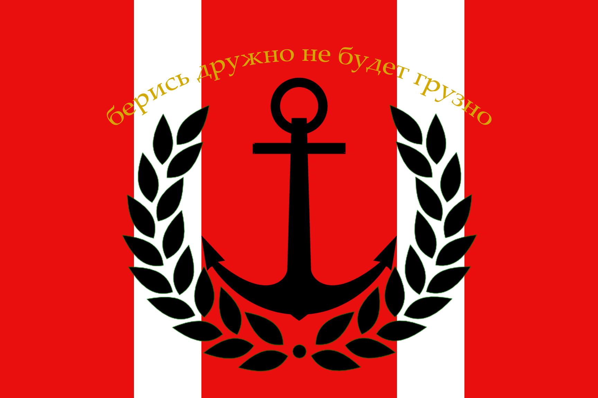
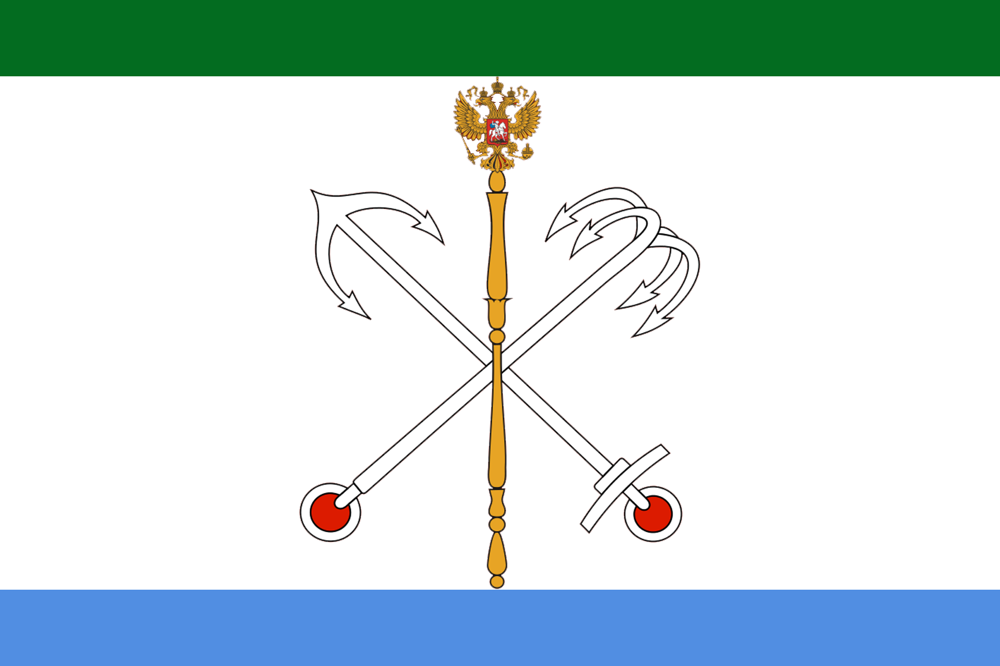
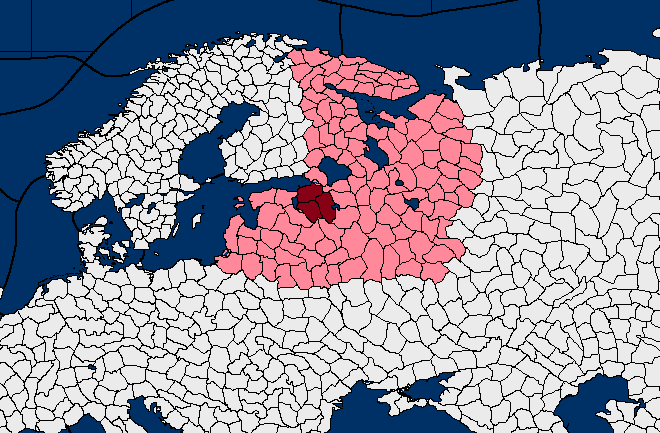

# `Niedzwiedz polarny.png`

I received a response the following day, as well as a Reddit DM/follow back.




## Niedzwiedz polarny

This is Polish for `Polar bear`, ends up being a hint for zenit-polar cipher when
combined with the team who plays at the stadium in coordinates.

## Steganography

There are coordinates and a bit.ly URL hidden in the image, they give you the color but in interest of time I used a random map.



### Coordinates

[59°58'22.3"N  30°13'16.8"E](https://www.google.ca/maps/place/59%C2%B058'22.3%22N+30%C2%B013'16.8%22E/@59.9731255,30.2172644,16z/data=!4m5!3m4!1s0x0:0x0!8m2!3d59.9728611!4d30.2213333)



### bit.ly

`hrrzs://bar.ny/4ralop43`

Solved with [zenit-polar substitution cipher](https://pt.wikipedia.org/wiki/Zenit_Polar) to: https://bit.ly/4tinez43

## Symbol

Reverse image searching the symbol resulted in [this reddit thread](https://www.reddit.com/r/WastelandPowers/comments/3ueodk/claim_civ_57_%D0%BA%D1%80%D0%B0%D1%81%D0%B8%D1%81%D1%82%D0%B0%D1%8F_krasistaya/).

Posted by [`u/thefaber451`](https://www.reddit.com/user/thefaber451/)

### The Post

Documented in case removed

```
[CLAIM] [CIV] [57] Красистая (Krasistaya)
CLAIM

Name:

(And naming history)

Красомочнанелни | Krasamochnanyelni (Beautiful and Mighty Land)

Красичанель | Krasichanyel

Красистевстая | Krasistevstaya (Beautiful Kingdom of the North)

Красистая | Krasistaya

At first, when Krasistaya was a loose tribal confederation, it was named after the land and that’s where it got the name Krasamochnanyelni. Over time its name was shortened to Krasichanyel. When Tsar Pyotr I organized Krasichanyel into a kingdom, he renamed is Krasistevstaya to reflect its new nature as a kingdom. Then, just as Krasamochnanyelni was shortened to Krasichanyel, Krasistevstaya was shortened to Krasistaya.

Location

Map

(dark red is Krasistaya, pink is Krasistaya's claims)

Capital: Sosnovy Bor

Other Important cities: Veliky Novgorod, Novopskov

Demonym:

Красояр | Krasoyar (coming from the name of the nation, Krasistaya) - this is what foreigners refer the people of Krasistaya as

Друж | Druzh (coming from the Russian word for friend) - this is what the inhabitants of Krasistaya refers to themselves and each other as

Motto: Берись дружно, не будет грузно. - Take hold of it together, it won’t feel heavy.

Symbolism:

National flag

Naval flag

The birch tree and the forest is very important to the Krasoyar people, just as it always has been to those who inhabit Russia. It is a symbol of hope, purity, beauty, and light - especially prevalent to those who inhabit the region during its long dark winters, it gives them hope of a bright and lively spring. Every Krasoyar knows at least three different songs about birch forests or birch trees or their goddess Bereza, Lady of Birch.

Religion is also very important to the Krasoyar people and they often wear a pendant of one of the gods. These pendants will often coincide with their occupation. For example, a soldier may wear a symbol of Vladar, the Conqueror; a fisherman is more likely to wear a symbol of Sirny, the Vast and Vicious Sea (or he may fly Sirny’s banner over his boat).

Speaking of Sirny and the sea, the Krasoyar have a great respect and reliance on the sea. They are great sailors (both on the rivers and the sea) and much of their food is fish, other seafood, or some sort of aquatic plant. While being a fisherman is hard laborious work, it is also seen as being a very respectable job.

The emblem on the flag of Krasistaya is the emblem found on the St. Petersburg flag, taken as the descendants of survivors from St. Petersburg make up a large portion of the population and of the ultimate goals of Krasistaya is to reclaim St. Petersburg and return it to its former glory. The blue band along the bottom represents the Baltic Sea, the white background represents the birch forests in Krasistaya and the long winters and their great snows, the green along the top is representative of the leaves of the birch trees and the constant hope and strength the Krasoyar for a better future just like their hope for spring in the dead of winter.

The naval flag of Krasistaya is nearly as commonly used as the national flag and it is nearly as important too. The anchor represents, obviously, the navy and the wreath surrounding it represents the glory of the navy. The red background represents the blood that Krasistaya was founded on and the fires that burn in the brave hearts of its servicemen. The two white bands represent, again two birch trees - both because of their importance to the Krasoyar people and also because of how Krasistaya’s forests give themselves to build the kingdom’s navy. Also on the flag is Krasistaya’s national motto.

Important people:

Tsar Ilya Nikitin

Tsarina Ekaterina Nikitin

Tsarevna Katya Ilyinicha Nikitin

Tsesarevich Vladar Ilyich Nikitin

Tsarevich Nikita Ilyich Nikitin

Oleg Aleksandrovich Repnin, Lord of Sosnovy Bor and the province of Ingria

Nikolai Ivanovich Zubov, Lord of Veliky Novgorod and the province of Ilmen

Arkady Vadimovich Drozdenko, Lord of Novopskov and the province of Peipsky

Religion:

Владар | Vladar, the Conqueror

Береза | Bereza, Lady of Birch

Лес | Les, King of the Woods

Сирний | Sirny, the Vast and Vicious Sea

Ангоста | Angosta, the Angel of Beauty

History

Two hundred and fifty years ago, Vladar the Conqueror unleashed his wrath upon the world, destroying all who defied the Motherland. Unfortunately, Vladar's presence in the mortal realm was destroyed by some evil mechanism of humanly destruction and he was banished from our world. This event has been named Vladar's Downfall, or sometimes just The Fall. After this came the Long Winter Большой Зимний - literally Big Winter). For 50 years there was chaos in the great birch forests of northern Russia. Though there were survivors of the Fall, but no semblance of societies or order among them. Until a great priest, Dmitriy, united a large group of survivors into the great birch forests along the Baltic Coast where they began the first society since Vladar's Downfall. They named their society after the land they lived in, calling it Krasamochnanyelni, which is a mashup of the words meaning beautiful and mighty land.

For 100 years this tribal society prospered mostly in peace, only having minor skirmishes with weaker and smaller tribes, incorporating them into their confederation. Until, 100 years ago Tsar Pyotr Nikitin I changed the tribal amalgamation into a kingdom and named himself Tsar and renamed the nation Krasistevstaya, a mashup of the words meaning beautiful kingdom of the north. Under his rule the nation became much more unified and strong. He conquered all the land currently owned by Krasistaya and since then his strong and unbroken line has ruled the land in peace.

Now, Pyotr's descendant Tsar Ilya has come to the throne. When a boy he was known as Ilya the bard by the commoners due to his love for storytelling, poetry, and music. But now he has grown into a man and is changing his nation into a powerful force, intent on conquering the nearby lands and returning Russia to her former glory.
```

### Images in Post







### Possible Leads

https://www.amazon.ca/%D0%9A%D1%80%D1%83%D0%B3%D0%BE%D0%BC-%D0%B2%D1%80%D0%B0%D0%B3%D0%B8/dp/B07D69X4Y1

https://familiarockboyz.bandcamp.com/track/--2
