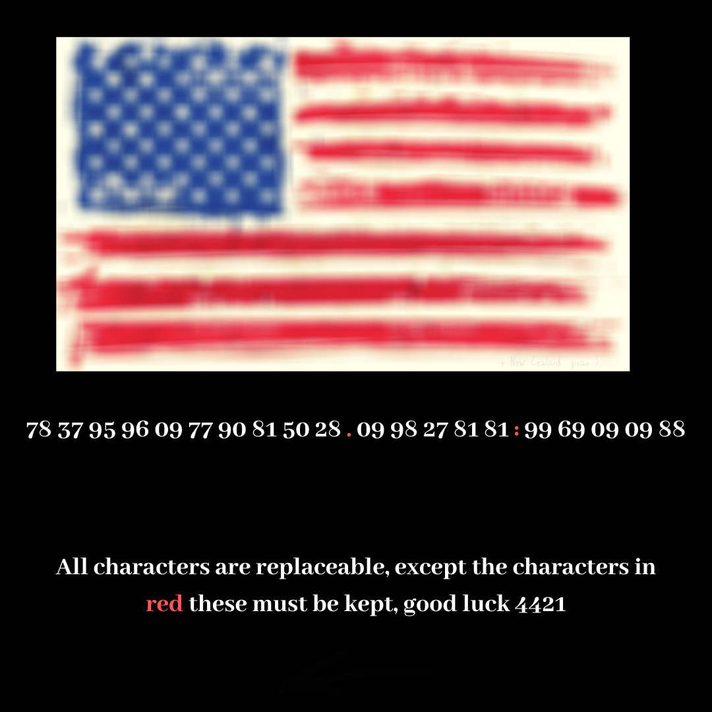
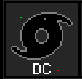
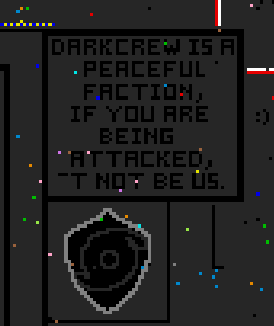
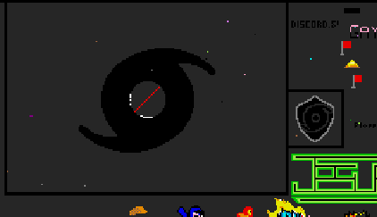
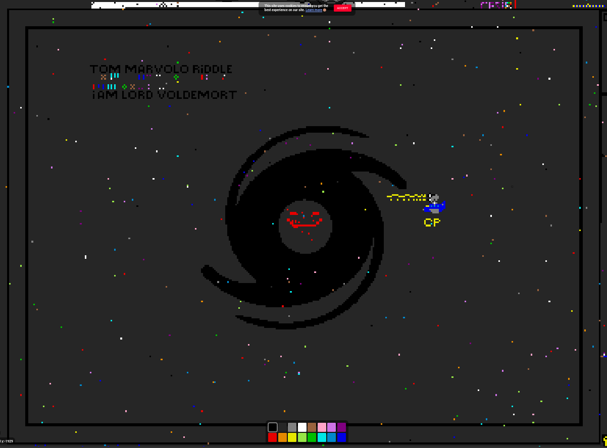
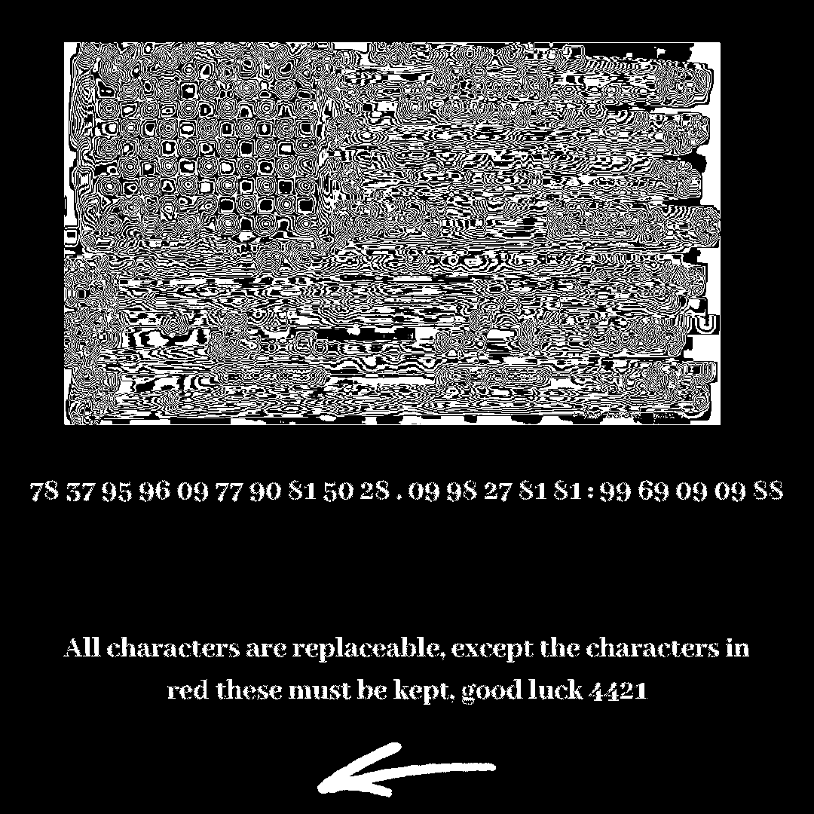
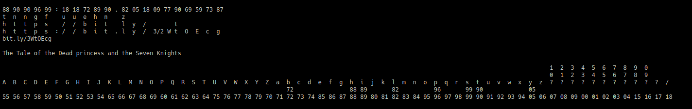

# E pluribus unum.png



## E pluribus unum

Latin for

>Out of Many, One

## Reverse Image Search of Flag

Resulted in an [r/AmericanFlaginPlace post](https://www.reddit.com/r/AmericanFlaginPlace/comments/636r1s/you_guys_should_put_some_of_the_state_flags/).

### pixel.io

Within the subreddit there were users [building a new flag](https://www.reddit.com/r/AmericanFlaginPlace/comments/ankvh3/i_say_we_restart_the_flag_we_all_gotta_work/).

https://pixelzone.io/?p=0,0

#### Out of many, One and eagleeye relations

There are many logo's that look like eagle eyes (I know it as the werplogo.png from [pain.net](http://pain.net)). Previously thought to be the pan-american information network, but is appearing to be `Dark Crew` or `DC`.








## Steganography

There is a left arrow hidden in the blue/green channel. I believe this is telling us to look left on pixel.io, but unconfirmed so far.



## Code

```
78 37 95 96 09 77 90 81 50 28 . 09 98 27 81 81 : 99 69 09 09 88
```

First, the arrow directs us to reverse the string.

```
88 90 90 96 99 : 18 18 72 89 90 . 82 05 18 09 77 90 69 59 73 87
```

Knowing bit.ly is used we can deduce the first part of the URL and a letter of the path.

```
88 90 90 96 99 : 18 18 72 89 90 . 82 05 18 09 77 90 69 59 73 87
h  t  t  p  s  : /  /  b  i  t  . l  y  /  ?  ?  t  ?  ?  ?  ?

A  B  C  D  E  F  G  H  I  J  K  L  M  N  O  P  Q  R  S  T  U  V  X  Y  Z

a  b  c  d  e  f  g  h  i  j  k  l  m  n  o  p  q  r  s  t  u  v  x  y  z
   72                88 89       82                      90
0  1  2  3  4  5  6  7  8  9  /
                              18
```



## Possible loose ends

* Something to do with poem
* Never used eagleeye if werplogo is not correct - perhaps it is whatever decryption method was used in [Elite Dangerous](https://www.elitedangerous.com/), there were things to decrypt called Eagle Eye, too tired to dive in. There is also a multinational research initiative called `Aegis` which may be referring to the Aegis cipher.

>Aegis is represented by three minor factions: Aegis Research, Aegis Core, and Aegis Defense. Aegis Research's headquarters is Donar's Oak in Delphi. Aegis Core is based out of Dantec Enterprise in the Socho system, but also operates the Eagle Eye array from Sol. Lastly, Aegis Defense controls the Megaships sent to respond to systems experiencing an Incursion.
