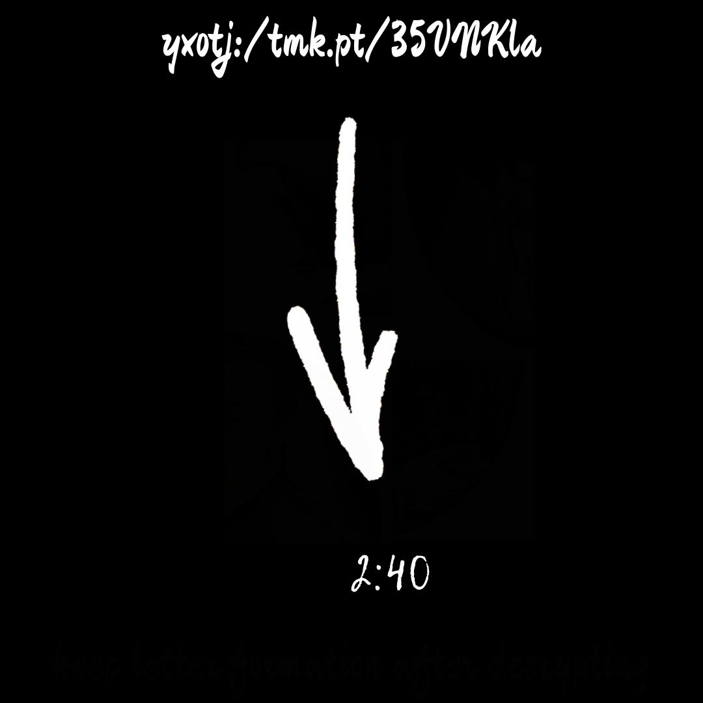
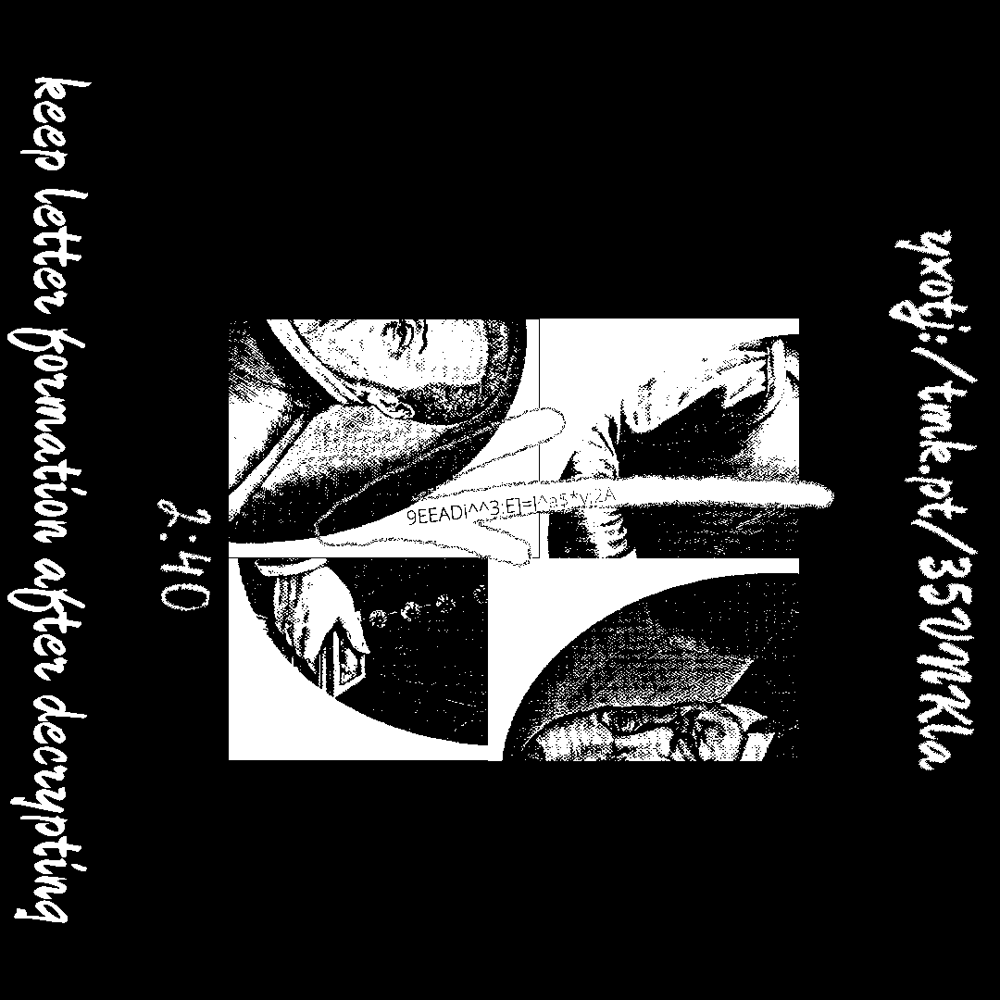
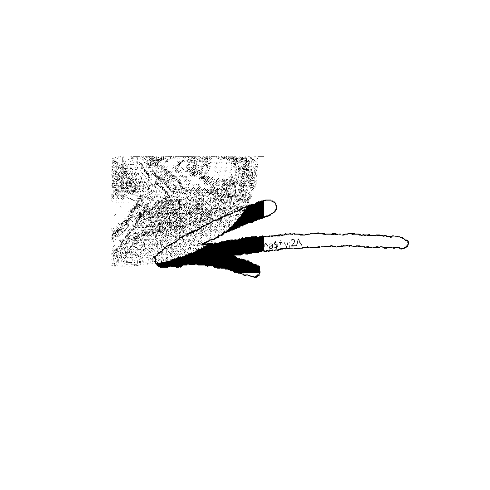
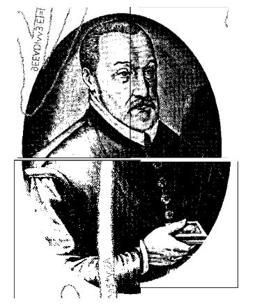

# tambah satu.png



## tambah satu

Malay for `add one`. This appears to be dual purpose for the top URL (adding a slash), and possibly adding an appointment to Safelite account.

## Steganography




And to see the other part more clearly



## 2:40

Possibly to add an appointment on Safelite appointment URL at 2:40.

## Top URL

```
yxotj:/tmk.pt/35VNKla
```

This is a Vigenere with key `REVERSE`, add a slash to complete URL.

https://bit.ly/35RWShj

## Keep letter formation after decrypting

I believe this is referring to add one, letters stay the same just need to add a slash.

## Arrow Code

ROT47

```
9EEADi^^3:E]=J^a$*v:2A
https://bit.ly/2SYGiap
```

## Image

This is a picture of Vigenere




