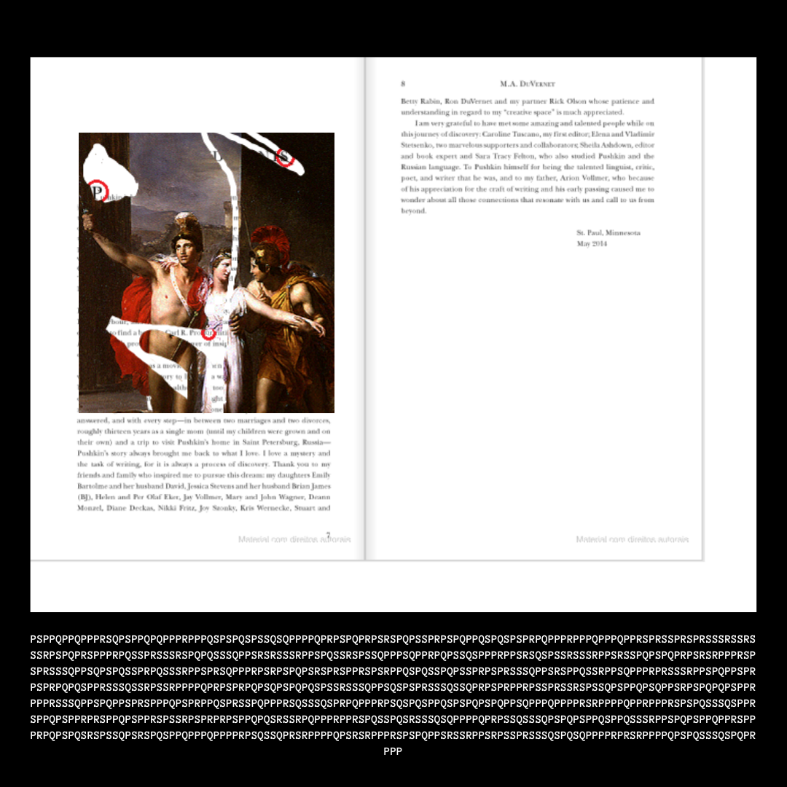
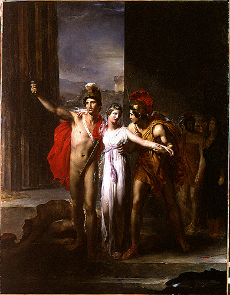

# 1800s.png

Found in Google Photos, no steganography (at least easily found).



## Painting



The painting is of [Helen Rescued by Castor and Pollux, 1817](https://en.wikipedia.org/wiki/Castor_and_Pollux#Rescuing_Helen) by [Léon Cogniet](https://en.wikipedia.org/wiki/L%C3%A9on_Cogniet)

## Book

The book is [Pushkin's Ode to Liberty: The Life and Loves of Alexander Pushkin](https://www.amazon.com/Pushkins-Ode-Liberty-Alexander-Pushkin-ebook/dp/B0794HFW6T), the end of the Acknowledgements section is depicted.

The **S** in Acknowledgements is circled along with the **P** of Pushkin. The other circle is over `Carl R. Proffer`, but the image is too fuzzy to see clearly. It appears to be **QR** but there is no *Qr* in his name... These end up being replacements for morse code on decryption, this is known as a Pollux Cipher - hint taken from painting name.

## Cipher Transcription

Transcription done with Tesseract.

Command used in case of need to sanitize image and re-run.

`tesseract --oem 1 1800s_cipher_inverted.png 1800s_cipher_inverted.png.txt`

Whitespace removed

```
PSPPQPPQPPPRSQPSPPQPQPPPRPPPQSPSPQSPSSQSQPPPPQPRPSPQPRPSRSPQPSSPRPSPQPPQSPQSPSPRPQPPPRPPPQPPPQPPRSPRSSPRSPRSSSRSSRSSSRPSPQPRSPPPRPQSSPRSSSRSPQPQSSSQPPSRSRSSSRPPSPQSSRSPSSQPPPSQPPRPQPSSQSPPPRPPSRSQSPSSRSSSRPPSRSSPQPSPQPRPSRSRPPPRSPSPRSSSQPPSQPSPQSSPRPQSSSRPPSPRSQPPPRPSRPSPQPSRSPRSPPRSPSRPPQSPQSSPQPSSPRPSPRSSSQPPSRSPPQSSRPPSQPPPRPRSSSRPPSPQPPSPRPSPRPQPQSPPRSSSQSSRPSSRPPPPQPRPSPRPQPSQPSPQPQSPSSRSSSQPPSQSPSPRSSSQSSQPRPSPRPPRPSSPRSSRSPSSQPSPPQPSQPPSRPSPQPQPSPPRPPPRSSSQPPSPQPPSPRSPPPQPSPRPPQSPRSSPQPPPRSQSSSQSPRPQPPPRPSQSPQSPPQSPSPQPSPQPPSQPPPQPPPPRSRPPPPQPPRPPPRSPSPQSSSQSPPRSPPQPSPPRPRSPPQPSPPRSPSSRPSPRPRPSPPQPQSRSSRPQPPPRPPRSPQSSPQSRSSSQSQPPPPQPRPSSQSSSQPSPQPSPPQSPPQSSSRPPSPQPSPPQPPRSPPPRPQPSPQSRSPSSQPSRSPQSPPQPPPQPPPPRPSQSSQPRSRPPPPQPSRSRPPPRSPSPQPPSRSSRPPSRPSSPRSSSQSPQSQPPPPRPRSRPPPPQPSPQSSSQSPQPRPPP
```

This is a Pollux cipher where dashes are **S**, dots are **P**, and spaces are **QR**.

## Decrypted

```
LISTLESS CYTHEREAN PRINCESS SING NO MORE BE GONE OUT OF MY VIEW BUT YOU GREAT SCOURGE OF TSAR AND KING PROUD MUSE OF FREEDOM WHERE ARE YOU COME RIP MY LAURELS OFF BRING STONES AND CRUSH THIS CODDLED LYRE LET ME SING TO THE WORLD OF LIBERTY AND SHAME THAT SCUM UPON THE THRONES
```

This is a poem titled from a book titled, *The Sacred Lyre: Essays on the Life and Work of Alexander Pushkin*

[link here](https://webcache.googleusercontent.com/search?q=cache:uE9X0qmrKicJ:https://ar.subcithipuftado.pro/778.html+&cd=1&hl=en&ct=clnk&gl=ca&client=firefox-b-1-d)
