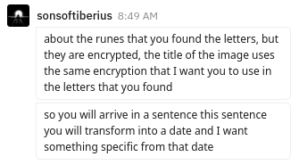

# gnyzbqvturg re ra qlq.png

Original image found in Google Drive.


Later corrected after I pointed out an error from the manual multilingual translation of its creator.


## Correction

First correction:


Second correction:


## Image Name

`gnyzbqvturg re ra qlq`

This is a Caesar cipher with key-shift 13, the cleartext is Norwegian. Knowledge of how to read the Elder Futhark was forgotten until 1865, when it was deciphered by Norwegian scholar Sophus Bugge.

```
talmodighet er en dyd
```

Translation: `patience is a virtue`

## Runes

Elder Futhark runes.

After finding [We love Egyptian art.png](../14-HTB19mzcpWSWBuNjSsrbq6y0mVXaA.jpg-analysis/README.md) in trash and decoding bit.ly hidden with steganography, a Rune Alphabet and symbol meanings were discovered.

Transcription:

```
VK BS NYHZVAHZ
CYHF TBYQ
JVGUBHG FVYIRE
```




From the hint we need to get of, which makes the runes wrong? `BS` required to ROT13 to `OF` in original image (fixed in first correction), `NYHZVAHZ` required to ROT13 to `ALUMINUM` (fixed in second correction).

ROT13:

```
IX OF ALUMINUM
PLUS GOLD
WITHOUT SILVER
```

### Date Transformation


Atomic numbers

* Aluminum - 13
* Gold - 79
* Silver - 47

This one makes more sense:

```
9   of 13+79-47=45
9th of 1945
```

Using the location the devices that were used to create the account (Frankfurt, Germany) I stumbled on [this](https://en.wikipedia.org/wiki/Bombing_of_Frankfurt_am_Main_in_World_War_II).

I went back to similar bombs and found out the US [Fat Man](https://en.wikipedia.org/wiki/Fat_Man) was dropped on Nagasaki on **9 August 1945**.

## Where to Go From Here

I believe this is trying to point out the following.

>Espionage information procured by [Klaus Fuchs](https://en.wikipedia.org/wiki/Klaus_Fuchs), [Theodore Hall](https://en.wikipedia.org/wiki/Theodore_Hall), and [David Greenglass](https://en.wikipedia.org/wiki/David_Greenglass) led to the first Soviet device "RDS–1" (above), which closely resembled Fat Man, even in its external shape.

According to the [Stimson Diary August 9, 1945](http://www.doug-long.com/stimson9.htm), the Russians declared war on Japan on August 8th, bomb was dropped on August 9th. In the Nuremburg trials, the legal basis for the trial was established by the London Charter, which was agreed upon by the four so-called Great Powers on 8 August 1945.

In [1800s.png](../1800s.png-analysis/README.md) we find that the painting is Castor and Pollux rescuing Helen which may be referring to [Helen Levitov Sobell](https://en.wikipedia.org/wiki/Helen_Levitov_Sobell)

Leaflet AB12, with information on the Hiroshima bomb and a warning to civilians to petition the Emperor to surrender was dropped over Japan beginning on August 9, by the 509th Composite Group.

## Research

* [Events of August 7-9](https://en.wikipedia.org/wiki/Atomic_bombings_of_Hiroshima_and_Nagasaki#Events_of_August_7%E2%80%939)
* [Hiroshima: Was it necessary?](http://www.doug-long.com/hiroshim.htm)
* [Hiroshima Memorandum for The Press](http://www.doug-long.com/memo8945.htm)
* [Stimson Diary August 9, 1945](http://www.doug-long.com/stimson9.htm)
* [Signal Intelligence Service (SIGINT)](https://en.wikipedia.org/wiki/SIGINT)
* [TICOM](https://en.wikipedia.org/wiki/TICOM)
* [Counter Intelligence Corps](https://en.wikipedia.org/wiki/Counter_Intelligence_Corps)
* [Los Alamos Laboratory](https://en.wikipedia.org/wiki/Los_Alamos_Laboratory)
* [Soviet atomic bomb project](https://en.wikipedia.org/wiki/Soviet_atomic_bomb_project)
* [Manhattan Project](https://en.wikipedia.org/wiki/Manhattan_Project)
* [Operation Alsos](https://en.wikipedia.org/wiki/Operation_Alsos)
* [Operation Paperclip](https://en.wikipedia.org/wiki/Operation_Paperclip)
* [Project Enormous](https://www.pbs.org/redfiles/kgb/inv/kgb_inv_ins.htm)
* [Venona Project](https://en.wikipedia.org/wiki/Venona_project)
* [Atomic Spies](https://en.wikipedia.org/wiki/Atomic_spies)
* [Potsdam Conference](https://en.wikipedia.org/wiki/Potsdam_Conference)
* [Nuremburg Trials](https://en.wikipedia.org/wiki/Nuremberg_trials)
* [United Nations Charter](https://en.wikipedia.org/wiki/United_Nations_Charter)
* [Einsten's Political Views/Involvement in Letter to FDR](https://en.wikipedia.org/wiki/Political_views_of_Albert_Einstein)

Books
  * [Spying Without Spies](https://books.google.ca/books?id=vPj0tpXjiWIC)
  * [Crimes and Trials of the Century](https://books.google.ca/books?id=UNex7XqLuiIC)

People
  * [Helen Levitov Sobell](https://en.wikipedia.org/wiki/Helen_Levitov)
  * [Morton Sobell](https://en.wikipedia.org/wiki/Morton_Sobell)
  * [Julius and Ethel Rosenberg](https://en.wikipedia.org/wiki/Julius_Rosenberg)
  * [Alexander Feklisov](https://en.wikipedia.org/wiki/Alexander_Feklisov)
  * [Klaus Barbie](https://en.wikipedia.org/wiki/Klaus_Barbie)


### Danish Rabbit Hole

Using a Caesar+5 with alphabet `FUÞARKGWHNIJÏPZSTBEMLŊOD`, you can get most of a Danish cleartext message.

```
ÞF FD RÆANÞOAN
FÆAM JÏÆF
GÞULÏAU MÞÆKDP
```

Danish to English translation

```
THF FD RANGE FAMOUS WORLDWIDE MAKEUP
```

### Periodic Rabbit Hole

13 - 9 + 79 - 47 = 36

36 = Krypton

Role positioning XY coordinates, free spin electrons, valence electrons?

MACHINE could be referring to WB-29 aircraft which recovered radioactive debris in air sampling scoops from the cloud generated by the first atomic bomb test by the Soviet Union on 29 August 1949

https://books.google.ca/books?id=vPj0tpXjiWIC&pg=PA230&lpg=PA230&dq=WB-29+krypton&source=bl&ots=qUs4S_9fVK&sig=ACfU3U1yY0VvLaoXs87nIH5joQqW1WSycw&hl=en&sa=X&ved=2ahUKEwiT0abzj-7pAhUQpZ4KHQAMDpUQ6AEwAXoECAsQAQ#v=onepage&q=1930&f=false

### Loose Ends/Possible Leads

* https://kryptosfan.wordpress.com/speculations/substitutions/is-k4-a-castor-cipher/
* https://kryptosfan.wordpress.com/challenges/cryptanalysis-contest/
* https://kryptosfan.wordpress.com/2009/08/28/castor-cipher/

## Image


Image is of the RDS-1 also known as the JOE-1 for Joseph Stalin. It was exploded on 29 August 1949 at 7:00 in the morning, at Semipalatinsk, Kazakh SSR, after a top-secret research and development in the framework of the Soviet atomic bomb project.

### Steganography

Not sure if anything but what appears to be a piece of an occult symbol was hidden over the RDS-1.


