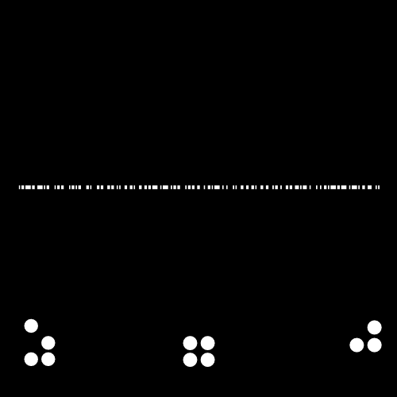
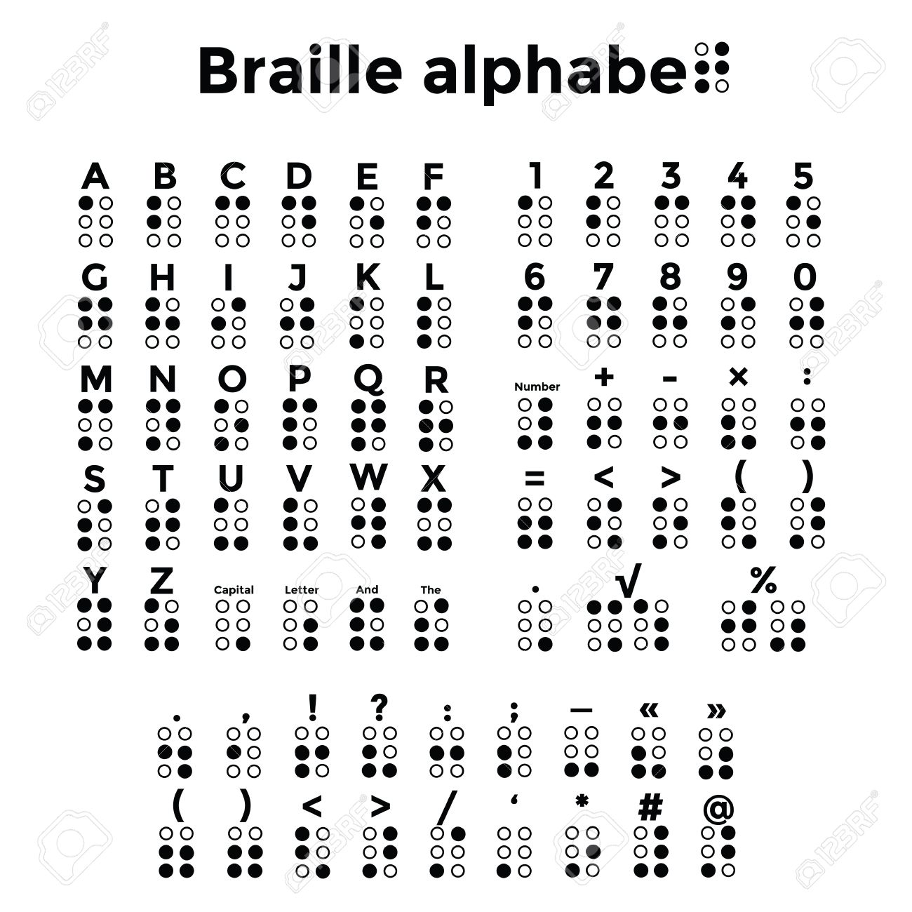

# dnaldoow hpesoj namron.png

No steganography, at least easily detected.

## Title

Reversed: [Norman Joseph Woodland](https://en.wikipedia.org/wiki/Norman_Joseph_Woodland)

> Woodland was born in Atlantic City, New Jersey, on September 6, 1921 to Jewish parents, the elder of two boys.[1]

> After graduating from Atlantic City High School, Woodland did military service in World War II as a technical assistant with the Manhattan Project in Oak Ridge, Tennessee. Woodland went on to earn his Bachelor of Science in Mechanical Engineering (BSME) from Drexel University (then called Drexel Institute of Technology) in 1947.[3] From 1948-1949, he worked as a lecturer in mechanical engineering at Drexel.

## Barcode

This is a Code128 barcode, I had to stretch and crop to get a proper read.

This resulted in https://bit.ly/365Hzlb, a PDF with my personal code to break.

## Braile

### Transcription

The braille is inverted, which is why [YOURCODE.png](../18-YOURCODE.pdf/README.md) is inverted.

`ICU`
