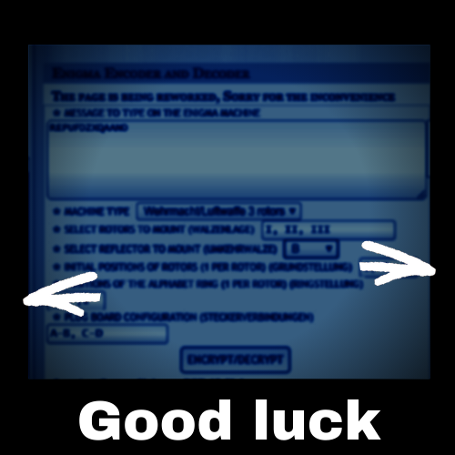
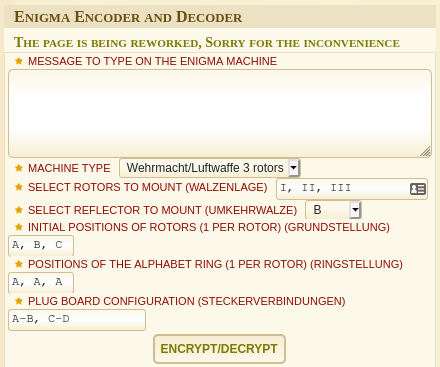
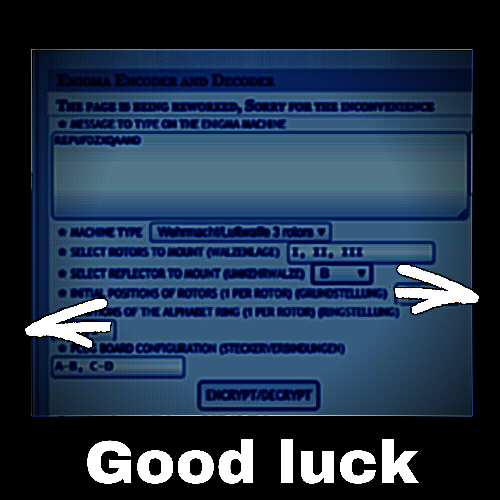

# YOURCODE.pdf

[YOURCODE.pdf](YOURCODE.pdf)

## Decoding

Base64 encoded PNG

`cat YOURCODE.txt | base64 -d > YOURCODE.png`

## Image

The image is of [dcode.fr's enigma encoder/decoder](https://www.dcode.fr/enigma-machine-cipher) rotor positions are masked by arrows. Need to sharpen image to get message and solve rotors.

Sharpened

## Ciphertext

`REPUFDZXQAANO`

### Solving

The initial rotor positions are unknown as well as the positions of the alphabet ring.

Wants me to use [dcode's enigma](https://www.dcode.fr/enigma-machine-cipher)

> Braille you will reach 3 letters that readed aloud form a sentence
> the arrows should be just  a direction you should write the letters

Using the inverted braille and the arrows - the initial position is `ICU` and the second is `UCI`.

This decrypts to `YOUARESOCLOSE`.
